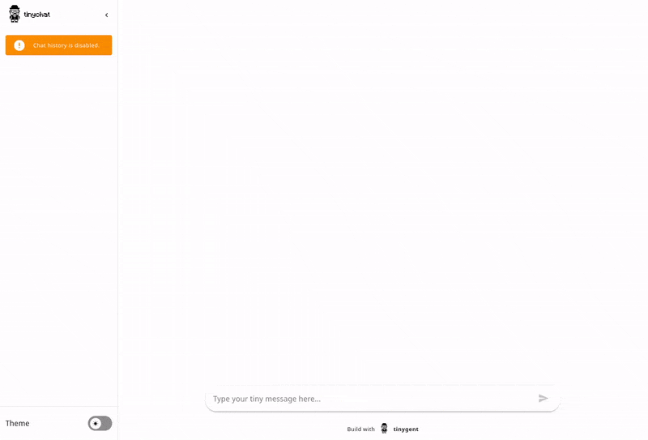
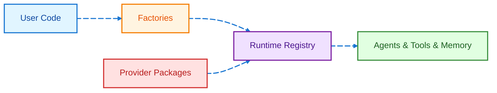

<div align="center">
  <picture>
    <source media="(prefers-color-scheme: dark)" srcset=".github/resources/images/logo-light.svg">
    <source media="(prefers-color-scheme: light)" srcset=".github/resources/images/logo-dark.svg">
    
  </picture>
</div>

<div align="center">
  <h3>Tiny platform for amazing agents</h3>

  <h4>
    <a href="https://github.com/filchy/tinygent">Homepage</a> | <a href="https://filchy.github.io/tinygent">Documentation</a> | <a href="https://filchy.github.io/tinygent/examples">Examples</a> | <a href="https://filchy.github.io/tinygent/examples/quick-start/">Quick Start</a>
  </h4>
</div>

Tinygent is a tiny agentic framework - lightweight, easy to use (hopefully), and efficient (also hopefully ;-0) library for building and deploying generative AI applications. It provides a simple interface for working with various models and tools, making it ideal for developers who want to quickly prototype and deploy AI solutions.

## Create an agent

```python
# uv sync --extra openai

from tinygent.tools import tool
from tinygent.core.factory import build_agent

@tool
def get_weather(location: str) -> str:
    """Get the current weather in a given location."""
    return f'The weather in {location} is sunny with a high of 75°F.'

agent = build_agent(
    'react',
    llm='openai:gpt-4o-mini',
    tools=[get_weather],
)

print(agent.run('What is the weather like in Prague?'))
```

## Getting Started

### Prerequisites

Before you begin using tinygent, ensure that you meet the following software prerequisites.

- Install [Git](https://git-scm.com/)
- Install [uv](https://docs.astral.sh/uv/getting-started/installation/)

### Install From Source

1. Clone the tinygent repository to your local machine.
    ```bash
    git clone git@github.com:filchy/tinygent.git tinygent
    cd tinygent
    ```

2. Create a Python environment.
    ```bash
    uv venv --seed .venv
    source .venv/bin/activate
    ```

3. Install the tinygent library.
    To install only the core tinygent library without any optional dependencies, run the following:
    ```bash
    uv sync
    ```

    To install the tinygent library along with all of the optional dependencies. Including developer tools (`--all-groups`), additional packages and all of the dependencies needed for profiling and plugins (`--all-extras`) in the source repository, run the following:
    ```bash
    uv sync --all-groups --all-extras
    ```

    > [!NOTE]
    > Not all packages are included in the default installation to keep the library lightweight. You can customize your installation by specifying the optional dependencies you need.

4. Install tinygent in editable mode (development mode), so that changes in the source code are immediately reflected:
    ```bash
    uv pip install -e .
    ```

## See It In Action

<div align="center">
  
</div>

## Architecture



Tinygent uses a registry-based plugin architecture: **Packages** register components into the **Runtime**. **Factories** query the Runtime to build **Components** for your code.

## Examples (Quick Start)

1. Ensure you have set the `OPENAI_API_KEY` environment variable to allow the example to use OpenAI's API. An API key can be obtained from [`openai.com`](https://openai.com/).
    ```bash
    export OPENAI_API_KEY="your_openai_api_key"
    ```

2. Run the examples using `uv`:
    ```bash
    uv run examples/agents/multi-step/main.py
    ```

3. Explore more examples below:

### Features & Examples

- **Basics** — [Tool Usage](examples/tool-usage), [LLM Usage](examples/llm-usage), [Function Calling](examples/function-calling)
- **Memory** — [Chat Buffer](examples/memory/basic-chat-memory), [Summary Buffer](examples/memory/buffer-summary-memory), [Window Buffer](examples/memory/buffer-window-chat-memory), [Combined](examples/memory/combined-memory)
- **Agents** — [ReAct](examples/agents/react/), [Multi-Step](examples/agents/multi-step/), [Squad](examples/agents/squad/), [MAP](examples/agents/map/), [Middlewares](examples/agents/middleware/)
- **Packages** — [OpenAI](packages/tiny_openai), [Anthropic](packages/tiny_anthropic), [Mistral](packages/tiny_mistralai), [Gemini](packages/tiny_gemini), [VoyageAI](packages/tiny_voyageai), [Brave](packages/tiny_brave/), [Chat](packages/tiny_chat), [Graph](packages/tiny_graph)

## Linting & Formatting

To ensure code quality, formatting consistency, and type safety, run:

```bash
uv run fmt   # Format code Ruff
uv run lint  # Run Ruff linter and Mypy type checks
```
