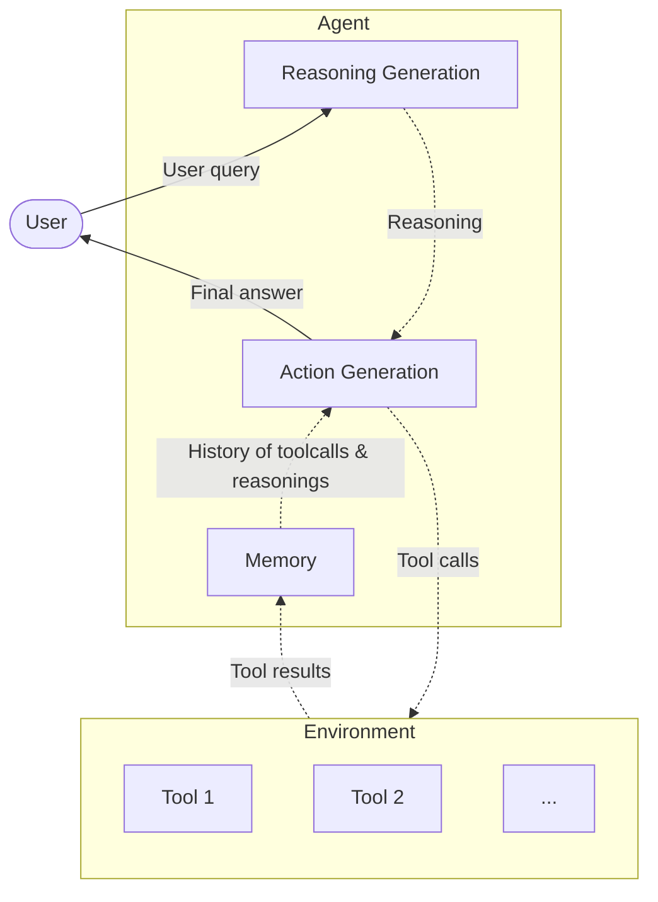

# TinyReActAgent Example - Reasong + Act Agent

This example demonstrates how to build and run a **ReAct style agent** (`TinyReActAgent`) using `tinygent`.
The agent alternates between **reasoning** and **acting**, while keeping track of tools and conversation history.



## Quick Start

```bash
uv sync --extra openai

uv run examples/agents/react/main.py
```

---

## Concept

The `TinyReActAgent` emits several **[hooks](../hooks/README.md)** during execution.  
You can subclass the agent and override these methods, or attach callbacks, to handle custom logging, monitoring, or UI integration.

| Hook                          | Trigger                                                             |
|-------------------------------|---------------------------------------------------------------------|
| `on_answer(answer: str)`      | When the agent emits a **final answer**.                            |
| `on_tool_reasoning(text: str)`| When the **ReasoningTool** is used and produces intermediate reasoning. |
| `on_error(error: Exception)`  | When an **exception** occurs during reasoning or tool execution.    |

---

## Hooks

The `TinyReActAgent` can emit:

- `on_answer(answer: str)` — when a final answer is produced  
- `on_tool_reasoning(reasoning: str)` — when a `ReasoningTool` emits reasoning  
- `on_error(error: Exception)` — when an exception occurs  

---

## Files

* `example.py` — runnable demo with two example tools.
* `agent.yaml` — prompt templates for reasoning and action generation.

---

## Quick Run

```bash
tiny terminal \
  -c examples/agents/react/agent.yaml \
  -q "What is the weather like in Tokyo?" \
  -q "What is the best travel destination?" \
```

---

## Example Tools

```python
from tinygent.tools.tool import tool
from tinygent.types import TinyModel
from pydantic import Field

class WeatherInput(TinyModel):
    location: str = Field(..., description="The location to get the weather for.")

@tool
def get_weather(data: WeatherInput) -> str:
    """Get the current weather in a given location."""
    return f"The weather in {data.location} is sunny with a high of 75°F."


class GetBestDestinationInput(TinyModel):
    top_k: int = Field(..., description="The number of top destinations to return.")

@tool
def get_best_destination(data: GetBestDestinationInput) -> list[str]:
    """Get the best travel destinations."""
    destinations = ["Paris", "New York", "Tokyo", "Barcelona", "Rome"]
    return destinations[: data.top_k]
```

---

## Example Agent

```python
from pathlib import Path
from tinygent.agents.react_agent import (
    ActionPromptTemplate,
    ReasonPromptTemplate,
    ReActPromptTemplate,
    TinyReActAgent,
)
from tinygent.llms import OpenAILLM
from tinygent.utils.yaml import tiny_yaml_load

react_agent_prompt = tiny_yaml_load(str(Path(__file__).parent / 'prompts.yaml'))

react_agent = TinyReActAgent(
    llm=OpenAILLM(),
    prompt_template=ReActPromptTemplate(
        reason=ReasonPromptTemplate(
            init=react_agent_prompt['reason']['init'],
            update=react_agent_prompt['reason']['update'],
        ),
        action=ActionPromptTemplate(action=react_agent_prompt['action']['action']),
    ),
    tools=[get_weather, get_best_destination],
)
```

---

## Running the Agent

### Blocking Mode

```python
result = react_agent.run(
    "Find the best travel destination and tell me the weather there."
)
print("[RESULT]", result)
print("[MEMORY]", react_agent.memory.load_variables())
```

### Streaming Mode

Use `run_stream` for incremental reasoning/tool updates suitable for live UIs or logs:

```python
import asyncio

async def stream_demo():
    async for chunk in react_agent.run_stream(
        "Find the best travel destination and tell me the weather there."
    ):
        print("[STREAM CHUNK]", chunk)

asyncio.run(stream_demo())
```

---

## Expected Output

```
[USER INPUT] Find the best travel destination and tell me the weather there.
--- ITERATION 1 ---
[1. ITERATION - Reasoning]: I should first decide the best destination.
[1. ITERATION - Tool Call]: get_best_destination({'top_k': 1}) = ['Tokyo']
--- ITERATION 2 ---
[2. ITERATION - Reasoning]: Now I should check the weather in Tokyo.
[2. ITERATION - Tool Call]: get_weather({'location': 'Tokyo'}) = The weather in Tokyo is sunny with a high of 75°F.
[RESULT] The best travel destination is Tokyo, and the weather there is sunny with a high of 75°F.
[MEMORY] {'chat_history': '... full conversation log ...'}
```
